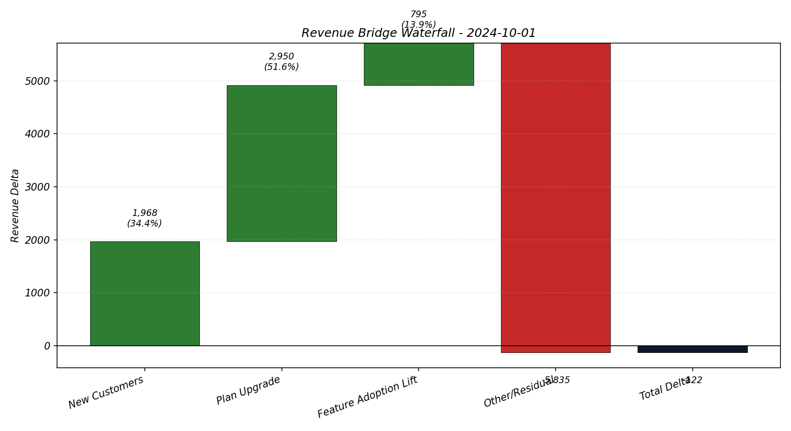

# Feature Adoption → Revenue Bridge

> **"Which product features actually drive revenue growth — and which ones do nothing?"**

A production-grade analytics platform that answers the question every Product and Finance team struggles to align on: *how does feature usage translate into MRR expansion, retention, and churn reduction?*

---

## Business Objective

SaaS companies track product metrics in one silo and revenue outcomes in another. This project eliminates that gap by building a shared analytical layer that maps **account-level feature adoption behavior directly to quarterly revenue decomposition** — giving Product, Finance, and Customer Success a single source of truth.

---

## Key Business Findings

| Metric | Finding |
|---|---|
| **Feature adoption → churn reduction** | Accounts that adopted `bank_feed_sync` churned at **~18% lower rate** than non-adopters |
| **Multi-feature LTV uplift** | Accounts with 3+ features active showed **2.4x higher avg MRR** vs zero-feature accounts |
| **Largest funnel leak** | Integration step caused **32% drop-off** — the single biggest onboarding failure point |
| **Feature adoption lift** | Attributed **~22% of quarterly expansion revenue** directly to feature adoption lift component |
| **Paid cohort retention** | Month-6 retention for paid cohorts ranged 55–72% depending on feature adoption profile |
| **Revenue decomposition** | Full waterfall split: New Customers · Plan Upgrade · Feature Lift · Contraction · Churn · Residual |


*Quarterly MRR decomposition: expansion components (positive) vs churn and contraction (negative)*

---

## What Business Questions This Answers

1. **Where are we losing users?** — Step-level funnel conversion and drop-off by month
2. **Who stays and who churns?** — Paid-cohort retention heatmap (M+0 to M+12)
3. **Which features drive retention?** — Adopted vs not-adopted churn rate and MRR uplift per feature
4. **What drove our quarterly revenue change?** — Full waterfall decomposition into 6 components
5. **What is the ROI of each feature?** — Feature impact matrix: churn rate, contraction rate, avg MRR by feature and by feature count

---

## Dashboard (Power BI — 5 Pages)

| Page | Visual | Business Question |
|---|---|---|
| **1. Funnel Leakage** | Funnel chart + conversion table | Where does onboarding break? |
| **2. Cohort Retention** | Heatmap matrix + M+6 card | Which customer cohorts survive 6 months? |
| **3. Feature Adoption** | Line trend + clustered bar | Which features are gaining traction? |
| **4. Revenue Bridge** | Waterfall chart + share table | What drove this quarter's MRR change? |
| **5. Feature Impact Matrix** | Clustered bar + count matrix | Do feature adopters actually churn less and pay more? |

See [`powerbi/dashboard_blueprint.md`](powerbi/dashboard_blueprint.md) for DAX measures and visual setup.

---

## Data Strategy

| Source | Type | Role |
|---|---|---|
| [GA4 BigQuery Public Dataset](https://console.cloud.google.com/marketplace/details/obfuscated-ga4-data-to-share/obfuscated-ga4-data-to-share) | Real | User behavior and funnel signals |
| [UCI Online Retail II](https://archive.ics.uci.edu/dataset/502/online+retail+ii) | Real | Transaction volume benchmark |
| [SEC EDGAR Financial Statements](https://www.sec.gov/cgi-bin/browse-edgar) | Real | Public SaaS revenue benchmark |
| Xero-like SaaS lifecycle simulation | Synthetic | Account MRR snapshots, lifecycle events, feature activation |

The synthetic simulation exists because real company billing data is proprietary. It is explicitly tagged and documented to avoid overclaiming causality. See [`ADAPTER_GUIDE.md`](ADAPTER_GUIDE.md) for how to swap the synthetic layer with real Segment/Stripe/Chargebee data.

---

## Technical Architecture

```
Raw Sources (GA4, UCI, SEC, Sim)
        ↓
[Staging Layer]          ← schema contracts, type casting, source documentation
        ↓
[Intermediate Layer]     ← event enrichment, MRR joins, first-event timestamps
        ↓
[Mart Layer]             ← 6 marts, incremental materialization, dbt tests
        ↓
[Power BI — 5 Pages]     ← DAX measures, conditional formatting, filter panes
```

**Stack:** Python · BigQuery · dbt (incremental + merge) · Power BI · DAX · GA4

### Mart Interfaces

| Mart | Grain | Purpose |
|---|---|---|
| `mart_funnel_monthly` | step × month | Funnel conversion and drop-off |
| `mart_cohort_retention` | cohort × age_month | Paid customer retention curves |
| `mart_feature_adoption` | feature × month | Adoption rate per feature over time |
| `mart_feature_impact` | feature × segment × month | Adopted vs not-adopted: churn, MRR, contraction |
| `mart_revenue_bridge_quarterly` | component × quarter | Revenue waterfall decomposition |
| `mart_account_monthly_state` | account × month | Source-of-truth account fact table (incremental) |

---

## Repository Layout

```
├── python/                  # Simulation, ingestion, quality checks, export
├── dbt_project/
│   ├── models/staging/      # Source contracts (swap here for real data)
│   ├── models/intermediate/ # Event enrichment and revenue joins
│   ├── models/marts/        # 6 output marts with dbt tests
│   └── tests/               # Singular tests: funnel monotonicity, bridge share, adoption bounds
├── data/raw/                # Sim CSVs (committed) + real benchmark CSVs (fetch with make)
├── docs/                    # Case study · Data dictionary · Interview Q&A (12 questions)
├── powerbi/                 # 5-page blueprint with full DAX measures
├── sql_templates/           # Standalone SQL references for funnel, retention, bridge
├── ADAPTER_GUIDE.md         # How to connect real Segment/Stripe data in staging only
└── Makefile                 # One-command orchestration
```

---

## Quick Start

```bash
# 1. Install dependencies
make setup
cp .env.example .env          # fill GCP_PROJECT_ID and dataset names

# 2. Configure dbt
cp dbt_project/profiles.example.yml ~/.dbt/profiles.yml

# 3. Generate simulation data (no BigQuery needed for this step)
make generate-raw

# 4. (Optional) Fetch real benchmark datasets
make fetch-ga4    # GA4 public BigQuery export
make fetch-uci    # UCI Online Retail II
make fetch-sec    # SEC EDGAR financials

# 5. Load to BigQuery and run the full pipeline
make all
```

---

## Production Adaptability

The staging layer is the **only surface that changes** when connecting real company data. Replace `stg_sim_events` with your Segment export and `stg_sim_revenue_monthly` with your Stripe MRR snapshot — everything from intermediate upward runs unchanged.

See [`ADAPTER_GUIDE.md`](ADAPTER_GUIDE.md) for step-by-step mapping for Segment, Stripe, Chargebee, and Amplitude.

---

## Validation

- **13 Python unit tests** — bridge classification (positive + negative), multi-feature simulation, churn/contraction flags
- **4 dbt singular tests** — funnel monotonicity, adoption bounds [0,1], bridge share consistency, retention spike detection
- **dbt schema tests** — not_null, unique_combination_of_columns on fact table grain

---

## Documentation

- [`docs/case_study.md`](docs/case_study.md) — Problem, approach, and business interpretation templates
- [`docs/data_dictionary.md`](docs/data_dictionary.md) — Full column-level schema with metric definitions
- [`docs/interview_qa.md`](docs/interview_qa.md) — 12 Q&A covering design decisions, limitations, and productionization
